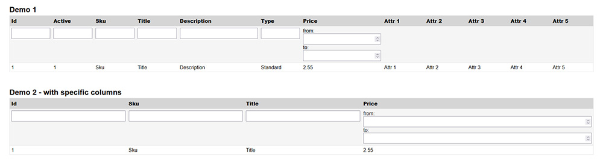

# Table Service

The Table Service provides a way for building tables easily.

## Table of Contents

- [Getting started](#getting-started)
	- [Requirements](#requirements)
	- [Highlights](#highlights)
    - [Screenshots](#screenshots)
    - [Simple Example](#simple-example)
- [Documentation](#documentation)
    - [Create Table](#create-table)
    - [Create Rows](#create-rows)
    - [Create Row](#create-row)
    - [Row Methods](#row-methods)
    - [Custom Row](#custom-row)
    - [Render Table](#render-table)
        - [Default Renderer](#default-renderer)
        - [Custom Renderer](#custom-renderer)
- [Credits](#credits)
___

# Getting started

Add the latest version of the Table service project running this command.

```
composer require tobento/service-table
```

## Requirements

- PHP 8.0 or greater

## Highlights

- Framework-agnostic, will work with any project
- Decoupled design
- Customize rendering

## Screenshots

<br/>

## Simple Example

```php
use Tobento\Service\Table\Table;

$table = new Table('products');

$table->row([
    'sku' => 'Sku',
    'title' => 'Title',
    'description' => 'Description',
    'price' => 'Price',
])->heading();

$table->row([
    'sku' => 'shirt',
    'title' => 'Shirt',
    'description' => 'A nice shirt in blue color.',
    'price' => 19.99,
]);
```

**Render the table**

```php
<?= $table->render() ?>

// or just
<?= $table ?>
```

**Both tables from above will produce the following output**

```html
<div class="table">
    <div class="table-row th">
        <div class="table-col grow-1">Sku</div>
        <div class="table-col grow-1">Title</div>
        <div class="table-col grow-2">Description</div>
        <div class="table-col grow-1">Price</div>
    </div>
    <div class="table-row">
        <div class="table-col grow-1">shirt</div>
        <div class="table-col grow-1">Shirt</div>
        <div class="table-col grow-2">A nice shirt in blue color.</div>
        <div class="table-col grow-1">19.99</div>
    </div>
</div>
```

# Documentation

## Create Table

```php
use Tobento\Service\Table\Table;
use Tobento\Service\Table\TableInterface;
use Tobento\Service\Table\Renderer;

$table = new Table(
    name: 'products',
    columns: ['title', 'description'], // The columns to render only.
    renderer: new Renderer(),
);

var_dump($table instanceof TableInterface);
// bool(true)

// Get the name of the table:
var_dump($table->name());
// string(8) "products"
```

### With Methods

You might change some data or implentation by the following "with methods" returning a new instance.

**withColumns**

```php
use Tobento\Service\Table\Table;

$table = new Table('products');

$newTable = $table->withColumns(['sku', 'title']);

var_dump($table === $newTable);
// bool(false)
```

**withRenderer**

```php
use Tobento\Service\Table\Table;
use Tobento\Service\Table\Renderer;

$table = new Table('products');

$newTable = $table->withRenderer(new Renderer());

var_dump($table === $newTable);
// bool(false)
```

## Create Rows

**Creating rows from array items**

```php
use Tobento\Service\Table\Table;

$table = new Table('products');

$table->rows([
    [
        'sku' => 'shirt',
        'title' => 'Shirt',
        'description' => 'A nice shirt in blue color.',
        'price' => 19.99,
    ],
    [
        'sku' => 'cap',
        'title' => 'Cap',
        'description' => 'A nice cap.',
        'price' => 11.99,
    ],    
]);
```

**Using a callback for creating rows**

You may use a callback for creating rows if you provide an array of objects for instance or want to create only specific row columns.

```php
use Tobento\Service\Table\Table;
use Tobento\Service\Table\Row;

class Product
{
    public function __construct(
        protected string $title,
        protected float $price,
    ) {}

    public function title(): string
    {
        return $this->title;
    }
    
    public function price(): float
    {
        return $this->price;
    }         
}

$table = new Table('products');

$table->rows([
    new Product('Shirt', 19.99),
    new Product('Cap', 11.99),  
], function(Row $row, Product $product): void {
    $row->column(key: 'title', text: $product->title());
    $row->column(key: 'price', text: $product->price());
});
```

Create only specific row columns from an array of items:

```php
$table = new Table('products');

$table->rows([
    [
        'sku' => 'shirt',
        'title' => 'Shirt',
        'description' => 'A nice shirt in blue color.',
        'price' => 19.99,
    ],
    [
        'sku' => 'cap',
        'title' => 'Cap',
        'description' => 'A nice cap.',
        'price' => 11.99,
    ],
], function(Row $row, array $item): void {
    $row->column(key: 'title', text: $item['title']);
    $row->column(key: 'price', text: $item['price']);
});
```

## Create Row

**Creating a row from an array**

```php
use Tobento\Service\Table\Table;

$table = new Table('products');

$table->row([
    'sku' => 'shirt',
    'title' => 'Shirt',
    'description' => 'A nice shirt in blue color.',
    'price' => 19.99,
]);
```

**Using a callback for creating row columns**

You may use a callback for creating row columns if you provide an object.

```php
use Tobento\Service\Table\Table;
use Tobento\Service\Table\Row;

class Product
{
    public function __construct(
        protected string $title,
        protected float $price,
    ) {}

    public function title(): string
    {
        return $this->title;
    }
    
    public function price(): float
    {
        return $this->price;
    }         
}

$table = new Table('products');

$table->row(
    new Product('Shirt', 19.99),
    function(Row $row, Product $product): void {
        $row->column(key: 'title', text: $product->title())
            ->column(key: 'price', text: $product->price());
    }
);
```

## Row Methods

**Heading**

You may mark the row as a heading.

```php
use Tobento\Service\Table\Table;

$table = new Table('products');

$table->row([
    'title' => 'Title',
    'description' => 'Description',
])->heading();
```

**Id**

You may give the row an id to fetch it later.

```php
use Tobento\Service\Table\Table;

$table = new Table('products');

$table->row([
    'title' => 'Title',
    'description' => 'Description',
])->id('header');

$headerRow = $table->getRow('header');
```

**Each**

You may use the each method to create the row columns.

```php
use Tobento\Service\Table\Table;
use Tobento\Service\Table\Row;

$item = [
    'sku' => 'shirt',
    'title' => 'Shirt',
    'description' => 'A nice shirt in blue color.',
    'price' => 19.99,
];

$table = new Table('products');

$table->row()
      ->each($item, function(Row $row, $value, $key): void {
            $row->column($key, $value);      
      });
```

**When**

The when method will execute the given callback when the first argument given to the method evaluates to true.

```php
use Tobento\Service\Table\Table;
use Tobento\Service\Table\Row;

$table = new Table('products');

$table->row()
      ->when(true, function(Row $row): void {
          $row->column('actions', 'Actions');
      });
```

**Html**

You may mark columns as html, indicating that no escaping is done.

```php
use Tobento\Service\Table\Table;

$table = new Table('products');

$table->row([
    'sku' => 'shirt',
    'title' => 'Shirt',
    'description' => '<p>A nice shirt in blue color.</p>',
    'price' => 19.99,
])->html('description');
```

**PependHtml / AppendHtml**

You may prepend and append html to the row.

```php
use Tobento\Service\Table\Table;

$table = new Table('products');

$table->row([
    'sku' => '<input type="text" id="sku" name="sku">',
    'title' => '<input type="text" id="title" name="title">',
])->html('sku')
  ->html('title')
  ->prependHtml('<form>')
  ->appendHtml('</form>');
```

## Custom Row

You may use the addRow method to pass a custom row.

```php
use Tobento\Service\Table\Table;
use Tobento\Service\Table\RowInterface;

$table = new Table('products');

// must implement RowInterface
$customRow = new CustomRow();

$table->addRow($customRow);
```

### Render Table

There are different ways of rendering the table depending on your needs.

#### Default Renderer

The default renderer generates the table with DIV tags and calculates the columns size automatically.

```php
use Tobento\Service\Table\Table;
use Tobento\Service\Table\Renderer;

$table = new Table(
    name: 'products',
    renderer: new Renderer(),
);

$table->row([
    'sku' => 'Sku',
    'title' => 'Title',
    'description' => 'Description',
    'price' => 'Price',
])->heading();

$table->row([
    'sku' => 'shirt',
    'title' => 'Shirt',
    'description' => 'A nice shirt in blue color.',
    'price' => 19.99,
]);

echo $table;
```

Outputs:

```html
<div class="table">
    <div class="table-row th">
        <div class="table-col grow-1">Sku</div>
        <div class="table-col grow-1">Title</div>
        <div class="table-col grow-2">Description</div>
        <div class="table-col grow-1">Price</div>
    </div>
    <div class="table-row">
        <div class="table-col grow-1">shirt</div>
        <div class="table-col grow-1">Shirt</div>
        <div class="table-col grow-2">A nice shirt in blue color.</div>
        <div class="table-col grow-1">19.99</div>
    </div>
</div>
```

#### Custom Renderer

You might write your own renderer fitting your application.

```php
use Tobento\Service\Table\Table;
use Tobento\Service\Table\TableInterface;
use Tobento\Service\Table\RendererInterface;
use Tobento\Service\Table\Str;

class CustomRenderer implements RendererInterface
{
    public function render(TableInterface $table): string
    {
        if (empty($table->getRows())) {
            return '';
        }
            
        $html = '<table>';
        
        foreach($table->getRows() as $row)
        {
            if (empty($row->getColumns())) {
                continue;
            }
            
            $html .= '<tr>';
            
            if ($row->prependedHtml()) {
                $html .= $row->prependedHtml();
            }
            
            foreach($row->getColumns() as $column)
            {
                $text = $row->isHtml($column->key())
                    ? $column->text()
                    : Str::esc($column->text());
                
                if ($row->isHeading()) {
                    $html .= '<th>'.$text.'</th>';
                } else {
                    $html .= '<td>'.$text.'</td>';
                }
            }
            
            if ($row->appendedHtml()) {
                $html .= $row->appendedHtml();
            }
            
            $html .= '</tr>';
        }
        
        $html .= '</table>';
        
        return $html;
    }   
}

$table = new Table(
    name: 'products',
    renderer: new CustomRenderer(),
);
```

# Credits

- [Tobias Strub](https://www.tobento.ch)
- [All Contributors](../../contributors)